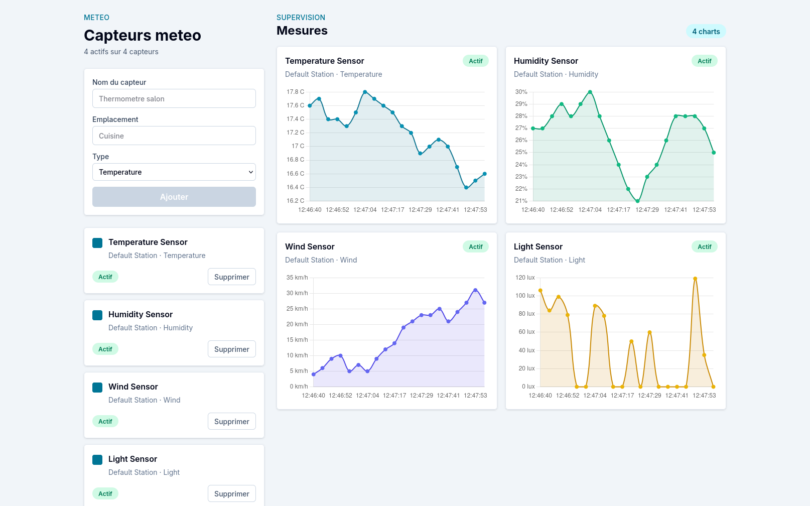

# Météo — Django et React

Météo est une application web full-stack pédagogique simulant une station météo, construite avec Django, SQLite, Inertia.js, React et Vite. Elle permet de gérer des capteurs, de générer des mesures fictives et de visualiser leur évolution sous forme de graphiques.

Le backend repose sur Django et utilise une base de données SQLite pour enregistrer les capteurs et leurs mesures.

L’interface React, intégrée avec Inertia.js et Vite, assure l’affichage des capteurs, des mesures enregistrées et des graphiques représentant leur évolution.



## Objectifs d'apprentissage

Ce projet sert de support pour pratiquer les bases d'un environnement Python :

- créer et utiliser un environnement virtuel ;
- installer des dépendances Python avec `pip` ;
- configurer un projet Django avec un fichier `.env` ;
- manipuler des modèles, des migrations et une base de données ;
- écrire et lancer des commandes Django personnalisées ;
- relier un backend Django à une interface React avec Inertia et Vite.

## Fonctionnalités

- gestion de capteurs météo : température, humidité, vent et luminosité ;
- ajout, activation, désactivation et suppression de capteurs ;
- génération de mesures simulées pour les capteurs actifs ;
- affichage des mesures dans des graphiques mis à jour régulièrement.

## Architecture

Le projet associe une application Django à une interface React :

- `app/` : application Django contenant les modèles, les vues, les routes et les commandes de gestion des capteurs et de leurs mesures, enregistrés dans SQLite ;
- `src/` : interface React rendue avec Inertia.js et compilée par Vite.

## Installation

### Prérequis

- Python ;
- Node.js ;
- pnpm.

### Backend

Créer et activer un environnement virtuel :

```bash
python -m venv .venv
source .venv/bin/activate
```

Installer les dépendances Python :

```bash
pip install -r requirements.txt
```

Créer le fichier d'environnement :

```bash
cp .env.example .env
```

Générer une clé secrète Django :

```bash
python -c "from django.core.management.utils import get_random_secret_key; print(get_random_secret_key())"
```

Puis remplacer `SECRET_KEY=null` dans `.env` par la valeur générée :

```env
SECRET_KEY=valeur_generee
```

Appliquer les migrations :

```bash
python manage.py migrate
```

### Frontend

Installer les dépendances frontend :

```bash
pnpm install
```

## Démarrage

Dans un premier terminal, lancer le serveur Vite :

```bash
pnpm dev
```

Vite fournit les ressources frontend et le hot reload sur le port `8001`.

Dans un second terminal, lancer le serveur Django :

```bash
python manage.py runserver
```

L'application sera disponible sur `http://127.0.0.1:8000/`.

## Générer des mesures

La commande `generate_sensor_readings` crée une mesure pour chaque capteur actif
et l'enregistre en base dans `SensorReading`.

Avant de générer des mesures, créer les capteurs par défaut :

```bash
python manage.py seed_sensors
```

Pour lancer une simulation continue toutes les 4 secondes :

```bash
python manage.py generate_sensor_readings --loop --interval 4
```
